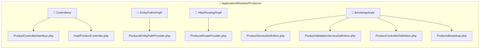
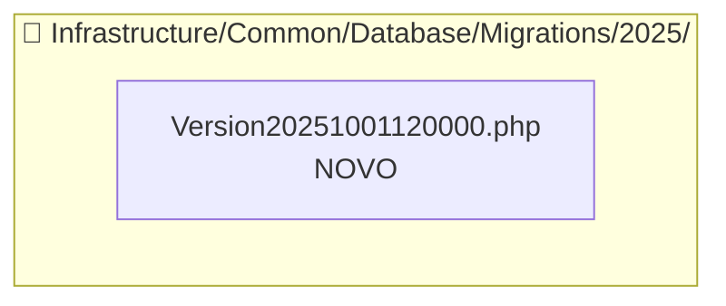
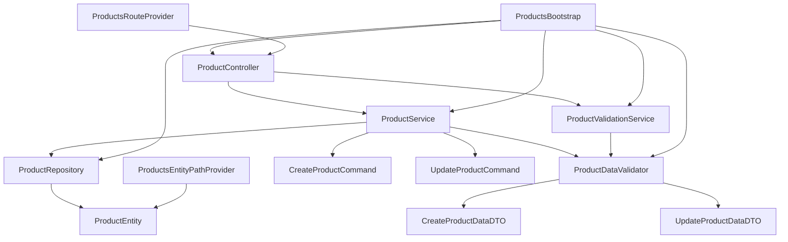

# Diagrama de Estrutura - Arquivos Criados/Modificados

**Autor:** Sistema PHP-OO  
**Data:** 2025-10-01

## Visão Geral da Arquitetura

```mermaid
graph TB
    subgraph "📁 PROJECT ROOT"
        subgraph "📁 docs/"
            A[📝 PHP OO Final Project.postman_collection.json<br/>MODIFICADO]
            B[📝 guia-implementacao-crud-produtos.adoc<br/>EXISTENTE]
            C[📝 arquivos-criados-modificados.md<br/>NOVO]
            D[📝 diagrama-estrutura.md<br/>NOVO]
        end
        
        subgraph "📁 src/"
            subgraph "📁 Application/"
                subgraph "📁 Modules/Products/ (NOVO)"
                    B1[📁 Controllers/]
                    B1a[ProductControllerInterface.php]
                    B1b[Impl/ProductController.php]
                    
                    B2[📁 EntityPaths/Impl/]
                    B2a[ProductsEntityPathProvider.php]
                    
                    B3[📁 Http/Routing/Impl/]
                    B3a[ProductsRouteProvider.php]
                    
                    B4[📁 Bootstrap/Impl/]
                    B4a[ProductServiceDefinition.php]
                    B4b[ProductValidationServiceDefinition.php]
                    B4c[ProductControllerDefinition.php]
                    B4d[ProductsBootstrap.php]
                end
                
                subgraph "📁 Shared/Orchestrator/Impl/"
                    E1[BootstrapOrchestrator.php<br/>MODIFICADO]
                end
            end
            
            subgraph "📁 Domain/"
                subgraph "📁 Common/Entities/Behaviors/"
                    F1[UuidableBehaviorInterface.php<br/>MODIFICADO]
                    F2[Impl/UuidableBehavior.php<br/>MODIFICADO]
                end
                
                subgraph "📁 Products/ (NOVO)"
                    G1[📁 Entities/]
                    G1a[ProductEntityInterface.php]
                    G1b[Impl/ProductEntity.php]
                    
                    G2[📁 Repositories/]
                    G2a[ProductRepositoryInterface.php]
                    G2b[Impl/ProductRepository.php]
                    
                    G3[📁 DTOs/Impl/]
                    G3a[CreateProductDataDTO.php]
                    G3b[UpdateProductDataDTO.php]
                    
                    G4[📁 Commands/Impl/]
                    G4a[CreateProductCommand.php]
                    G4b[UpdateProductCommand.php]
                    
                    G5[📁 Services/]
                    G5a[ProductServiceInterface.php]
                    G5b[Impl/ProductService.php]
                    G5c[ProductValidationServiceInterface.php]
                    G5d[Impl/ProductValidationService.php]
                    
                    G6[📁 Validators/]
                    G6a[ProductDataValidatorInterface.php]
                    G6b[Impl/ProductDataValidator.php]
                end
                
                subgraph "📁 Security/Entities/Impl/"
                    H1[UserEntity.php<br/>MODIFICADO]
                end
            end
            
            subgraph "📁 Infrastructure/Common/Database/Migrations/2025/ (NOVO)"
                I1[Version20251001120000.php<br/>NOVO]
            end
        end
    end
    
    style A fill:#ffeb3b
    style B fill:#4caf50
    style C fill:#2196f3
    style D fill:#2196f3
    style E1 fill:#ff9800
    style F1 fill:#ff9800
    style F2 fill:#ff9800
    style H1 fill:#ff9800
    style I1 fill:#4caf50
```

## Estrutura Detalhada por Camada

### 🏗️ **Domain Layer (12 arquivos)**

```mermaid
graph LR
    subgraph "📁 Domain/Products/"
        A[📁 Entities/]
        A1[ProductEntityInterface.php]
        A2[Impl/ProductEntity.php]
        
        B[📁 Repositories/]
        B1[ProductRepositoryInterface.php]
        B2[Impl/ProductRepository.php]
        
        C[📁 DTOs/Impl/]
        C1[CreateProductDataDTO.php]
        C2[UpdateProductDataDTO.php]
        
        D[📁 Commands/Impl/]
        D1[CreateProductCommand.php]
        D2[UpdateProductCommand.php]
        
        E[📁 Services/]
        E1[ProductServiceInterface.php]
        E2[Impl/ProductService.php]
        E3[ProductValidationServiceInterface.php]
        E4[Impl/ProductValidationService.php]
        
        F[📁 Validators/]
        F1[ProductDataValidatorInterface.php]
        F2[Impl/ProductDataValidator.php]
    end
    
    A --> A1
    A --> A2
    B --> B1
    B --> B2
    C --> C1
    C --> C2
    D --> D1
    D --> D2
    E --> E1
    E --> E2
    E --> E3
    E --> E4
    F --> F1
    F --> F2
```

### 🎯 **Application Layer (8 arquivos)**

### 🗄️ **Infrastructure Layer (1 arquivo)**

## Fluxo de Dependências

## Estatísticas por Tipo

| Tipo | Quantidade | Percentual |
|------|------------|------------|
| **Interfaces** | 8 | 25.8% |
| **Implementações** | 15 | 48.4% |
| **DTOs** | 2 | 6.5% |
| **Commands** | 2 | 6.5% |
| **Migrations** | 1 | 3.2% |
| **Documentação** | 3 | 9.7% |
| **TOTAL** | **31** | **100%** |

## Arquivos Modificados vs Novos

| Status | Quantidade | Percentual |
|--------|------------|------------|
| **Novos** | 27 | 87.1% |
| **Modificados** | 4 | 12.9% |
| **TOTAL** | **31** | **100%** |

## Resumo da Implementação

### ✅ **Arquivos Criados (27)**
- **Domain Layer:** 14 arquivos PHP
- **Application Layer:** 8 arquivos PHP  
- **Infrastructure Layer:** 1 arquivo de migração
- **Documentação:** 3 arquivos (2 .md + 1 .adoc + 1 .json modificado)

### 🔄 **Arquivos Modificados (4)**
- `BootstrapOrchestrator.php` - Adicionado ProductsBootstrap
- `UuidableBehaviorInterface.php` - Adicionado método getUuid()
- `UuidableBehavior.php` - Implementado método getUuid()
- `UserEntity.php` - Implementado método getUuid()

### 📊 **Total de Arquivos Alterados: 31**

**Status:** ✅ Implementação completa do CRUD de Produtos seguindo os padrões arquiteturais estabelecidos
